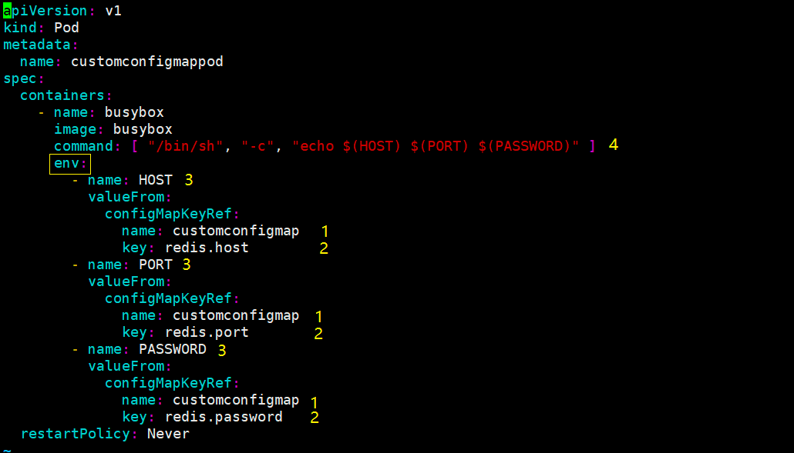

## config map 

### configMap 的作用
- ConfigMap 是存储数据的
- 一般是存储项目配置文件
- 提供环境变量和挂载两种方式


### 创建ConfigMap

#### 创建配置文件

```yaml
redis:
  host: 127.0.0.1
  password: 123
```

kubectl create configmap redis-config --from-file=redis.yaml 
</br>
redis-config：为这个configMap取得标识name


#### 查看相关信息

- kubectl describe configmap redis-config


### Pod 以挂载Volume 方式访问
#### 定义Pod的资源编排文件


#### Pod 以环境变量方式访问

**在ConfigMap 如果是数字的话需要用双引号起来**


#### 定义Pod编排文件

