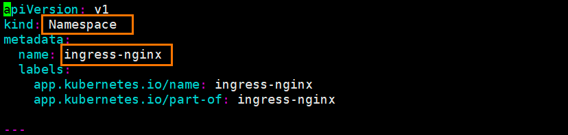
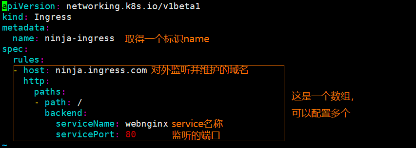

## k8s ingress

### k8s ingress 认识

#### k8s ingress 基本认识
- 在之前我们通过Service的类型ClusterIP,NodePort,LoadBalancer中的NodePort实现端口的暴露
，实现任意节点和暴露端口实现Pod的访问
- 这种方式有一个缺陷
    - 我们所暴露的的那个端口，在每个节点上都会被占用，也就是一个端口在集群中只能对应一个应用，只能使用一次
    - 实际访问中，一般我们是通过域名来访问，然后根据域名跳转到固定的
    - 这时候，NodePort 这种方式就出现了弊端，如何通过域名实现负载均衡访问我所有的Pod

#### ingress 工作流程

#### ingress 和Pod 的关系

- ingress 通过service和Pod 关联的

service 是通过labels关联Pod的

- ingress 作为统一的入口，会维护很多的域名

域名与Service进行关联。实现一个域名与多个Pod进行关联，实现负载均衡

### k8s ingress 使用

#### 环境初始化

- 创建一个测试的Pod

    kubectl create deployment webnginx --image nginx

- 暴露创建的Pod

    kubectl expose deployment webnginx --port 80 --target-port 80 --type NodePort

#### 部署ingress
    
- 然后是部署ingress 
- kubectl apply -f ingress-controller.yaml

- 查看ingress 部署信息
    - 该资源编排文件是创建一个名称空间
    - 所以我们需要指定名称空间去查看

- 查看ingress 的Pod 部署信息

kubectl get pods -n ingress-nginx 

#### 配置ingress 规则
