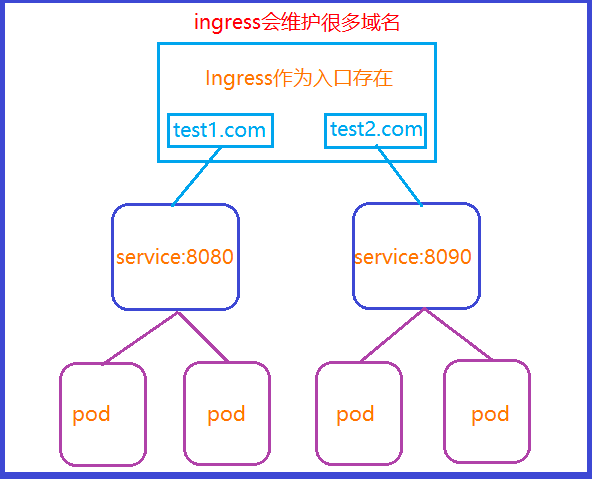

## k8s ingress

### k8s ingress 认识

#### k8s ingress 基本认识
- 在之前我们通过Service的类型ClusterIP,NodePort,LoadBalancer中的NodePort实现端口的暴露
，实现任意节点和暴露端口实现Pod的访问
- 这种方式有一个缺陷
    - 我们所暴露的的那个端口，在每个节点上都会被占用，也就是一个端口在集群中只能对应一个应用，只能使用一次
    - 实际访问中，一般我们是通过域名来访问，然后根据域名跳转到固定的
    - 这时候，NodePort 这种方式就出现了弊端，如何通过域名实现负载均衡访问我所有的Pod

#### ingress 工作流程

### k8s ingress 使用