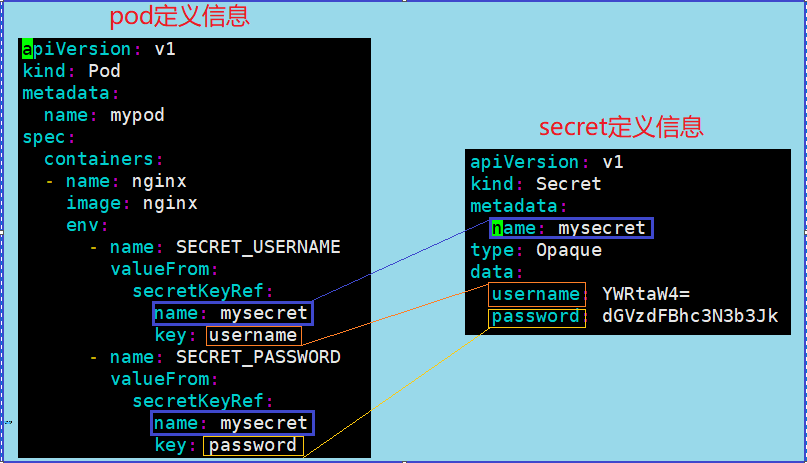
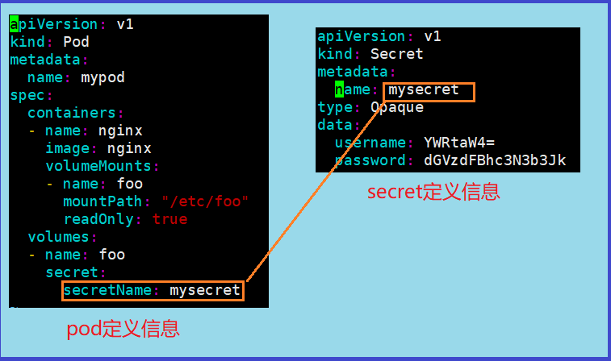

## Secret

### 存在的意义
- Secret 存在是为了解决密码、token、密钥等敏感信息的配置问题
- 我们不再将这些敏感数据存放到pod中，而是存放到pod 中
- 景象或者pod可以数据源volume或者使用环境变量方式进行读取访问

### 编辑Secret 的yml

```yaml
apiVersion: v1
kind: Secret
metadata:
  name: secret
type: Opaque
data:
  db_usernames: XXXXXX
```

### 创建Secret 加密数据

- kubectl create -f secret.yml

### Pod以环境变量方式访问

- env 表示读取secret 中的数据载入环境变量
- valueForm ： 其下属性都是用来定位敏感数据的
    - name 定位元数据名称
    - key 定位值
      上面的pod信息表示，从名为mysecret的元数据空间中取得key为username的值value,将这个value赋值给SECRET_USERNAME,并在环境变量中存在


### Pod以挂在Volume方式访问


- 将secret 挂载到数据数据卷Volume中
- 然手在spec > container中
  - 制定了会被挂载的数据源名称为foo
  - 指定了被挂载的路径
  - 设置数据卷的读写方式
  - 
    也就是说，容器挂载数据卷，数据卷挂载Secret，然后一条通道打通，在Pod中访问Secret中的数据