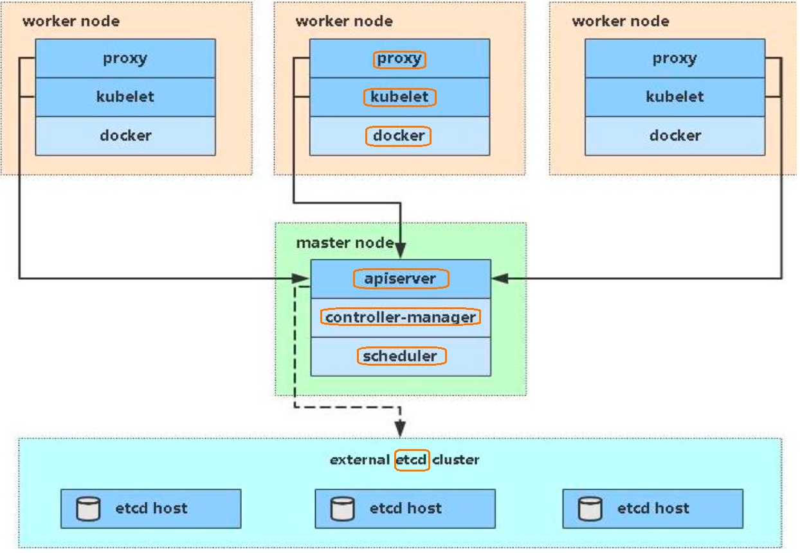

# 认识 k8s

## 核心概念
1. Node
Node 做为集群中的工作节点，运行真正的应用程序，在Node 上Kubernetes管理的最小运行单元是Pod，
,Node 上运行着Kubernetes 的Kubelet,kube-proxy 服务进程,这些服务进程负责Pod 的创建、启动、监控、重启、销毁以及实现软件模式的负载均衡

<br/>
Node 包含的信息：
    - Node 地址：主机的ip地址，或Node ID
    - Node 运行状态： Pending,Running ,Terminated 三种状态
    - Node 的系统容量：Node 可使用的系统资源，包括CPU,内存、最大可调度的Pod 数量
```
kubectl describe node // 查看Node 信息
```

2. Pod

   - 对于k8s而言，是最小的部署单元
   - 是一组容器的组合，可以是一个容器，也可以是多个容器的集合
   - Pod 内多个容器共享网络
   - 生命周期是短暂的，随时被创建也可以随时被干掉

 <br/>
每个Pod 里运行着一个特殊被称为Pause 的容器，其他容器被称为业务容器，这些业务容器共享Pause 容的网络栈和Volume挂载卷，因此他们之间的通信和数据交换更为高效<br/>
在设计时我们可以充分利用这一特性将一组密切相关的服务进程放入同一个Pod 中，同一个Pod里的容器之间仅需通过localhost就能通信系，这里当然要注意端口冲突问题，k8s为Pod设计了一套独特的网络配置，包括为每一个pod 分配一个ip 地址，使用pod名做为容器间通信的主机名
<p>一个Pod 中应用容器间共享一组资源</p>
    - PID 命名空间，Pod 中不同应用程序可以看到其他应用程序的进程Pid
    - 网络命名空间：Pod中的多个容器能访问同一个ip和端口范围
    - IPC 命名空间：Pod 中多个容器能够使用SystemV IPC 或者POSIX 消息队列进行通信
    - UTS 命名空间： Pod 中多个容器共享一个主机名
    - Volumes 共享存储卷：Pod 中哥哥容器可以访问Pod 级别定义的Volumes

3. RC （Replication Controller）
   - 目标Pod 的定义创建和灭亡管控
   - 确保预期的Pod 数量和对外提供服务
   - 无状态的应用部署
   - 有状态的应用部署

Replication Controller 负责Pod的生命周期的自动管理，实现自动创建和灭亡一个Pod,然后分配到一个Node上运行，以确保预期的Pod 正常运行，k8s通过Replication Controller 中定义的Label 筛选出对应的Pod实例，并监控其状态和数量，如果实例数量少于定义的副本数量Replicas<br/>
则会根据RC 中定义的Pod模版创建一个新的Pod,然后将此Pod 调度到合适的Node 上执行


4. Service
   - 定义一组Pod 的访问规则

   Pod 的IP都是有K8s自动分配的，但是随着Controller 的介入，Pod 的创建和灭亡都会产生新的IP 和失效的IP ，一个Service可以看作是提供相同服务的Pod的对外王文接口，如果Service要提供给外网服务，需要指定公共IP 和NodePort 或者外部负载均衡服务器
  - NodePort 系统会在k8s集群中的每个Node上打开一个主机的真实端口，这样，能够访问Node 的客户端就能通过这个端口访问到内部的Service

5. Volume

   - Volume 是Pod 中能够被多个容器访问的共享目录

6. Label

   - Label 是以key,value 形式附加在各种对象上，如Pod，Service,RC,Node 等

## k8s 集群架构组件介绍


1. etcd

    - 存储系统，用户存储集群相关的数据，持久化存储集群中所有的资源对象，如Node,Service,Pod,RC，Namespace等
API Server 中提供了操作etcd的封装接口API，这些API 基本上都是集群中资源对象的增删改查和监听资源变化的接口
   
2. Master Node
    - API Server
        提供资源对象的唯一操作入口，其他所有组件必须通过它提供的API 来操作资源数据，通过相关资源数据"全量查询"+"变化监听"，这些组件可以很"实时"地完成相关业务功能，API Server 内部有一套完备的安全机制，包括认证、授权和准如控制等相关模块
      - scheduler
          节点调度，集群中的调度器，负责Pod在集群中节点的调度分配2
    - controller manager
         集群中的管理控制中心，其主要目的是实现k8s 集群的故障检测和恢复自动化工作，比如根据RC的定义完成Pod 的复制或移除，以确保Pod 实例数符合RC副本的定义；
         根据Service 于Pod 的管理关系，完成服务的endpoints 对象的创建和更新，其他注入Node 的发现，管理和状态监管，镜像文件的清理工作都是有Controller Manager 完成的


3. Worker Node